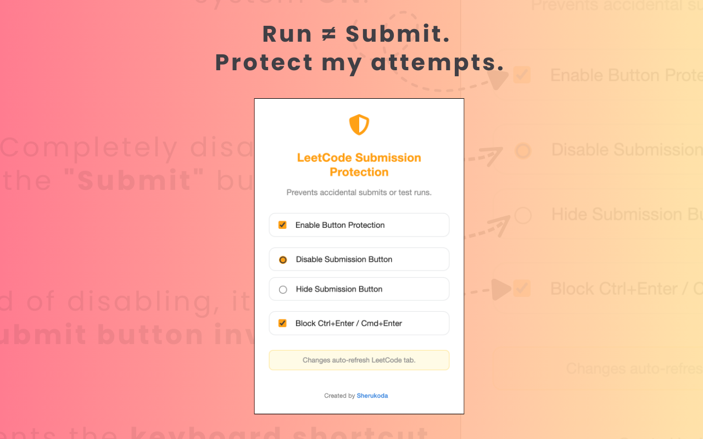
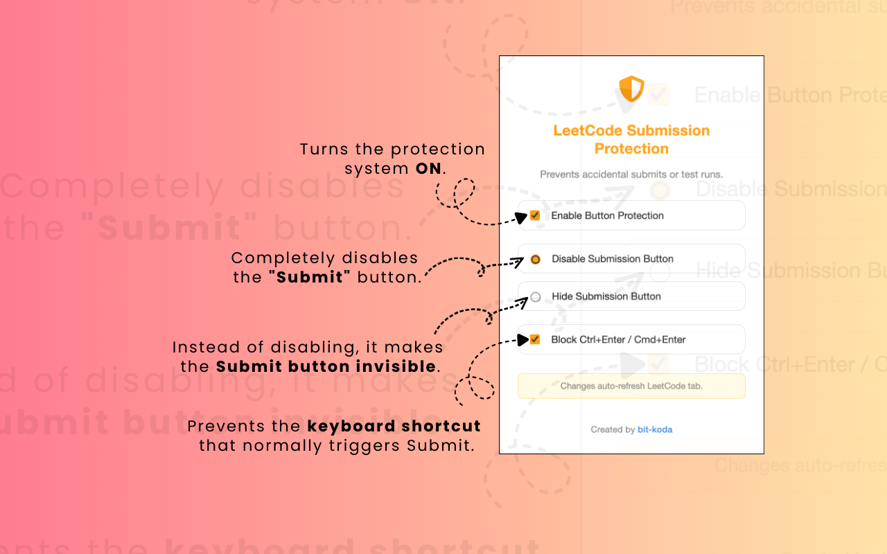
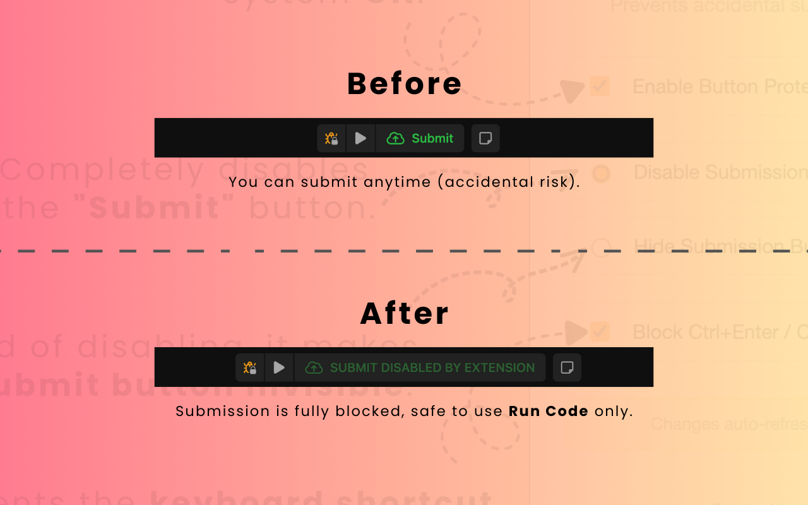

<h1 align="center">🛡️ LeetCode Submission Protection (v1.0.0)</h1>

<p align="center">
  <a href="https://github.com/sherukoda/LeetCode-Submission-Protection" target="_blank" rel="noreferrer noopener">
    
  </a>
</p>

<p align="center">
  Prevent accidental <b>Run</b> or <b>Submit</b> actions while solving problems on 
  <a href="https://leetcode.com">LeetCode</a>.
</p>

---

<p align="center">
  <!-- Replace with real store links after publishing -->
  <a href="https://addons.mozilla.org/en-US/firefox/addon/leetcode-submission-protection/">
    
  </a>
  <a href="https://microsoftedge.microsoft.com/addons/detail/leetcode-submission-prote/ogkkbklelkhjfchmejdcjiflnjkhemaj">
    
  </a>
</p>

<p align="center">
  <a href="https://github.com/sherukoda/LeetCode-Submission-Protection/stargazers">
    
  </a>
  <a href="https://github.com/sherukoda/LeetCode-Submission-Protection/blob/main/LICENSE">
    
  </a>
</p>

---

## ✨ Features

- 🧷 Disable or hide the **Submit** button  
- ⛔ Block accidental keyboard shortcuts (`Ctrl+Enter` / `⌘+Enter`)  
- 💾 Preferences saved automatically (via sync storage)  
- 🔁 Page auto-refresh when settings change  
- 🌍 Works on **Chrome, Firefox, and Edge**  
- 🎯 Runs only on `leetcode.com/*` for safety/lightweight design  

---

## 🖼️ UI Preview

### Extension Popup Menu
  
**Control panel where you toggle protection, disable or hide submit button, and block shortcuts.**

---

### Feature Examples
  
**Showcases each main feature (e.g., disabled submit button, hidden submit button, blocked shortcut).**

---

### Before & After Using Extension


**Comparison of LeetCode UI without protection (normal submit button) and with protection active (disabled or hidden submit button).**


---

## 📦 Installation

### From Store (Recommended)

- [Firefox Add-ons](https://addons.mozilla.org/en-US/firefox/addon/leetcode-submission-protection/)  
- [Edge Add-ons](https://microsoftedge.microsoft.com/addons/detail/leetcode-submission-prote/ogkkbklelkhjfchmejdcjiflnjkhemaj)  

### Manual (Developer Mode)

```
git clone https://github.com/sherukoda/LeetCode-Submission-Protection.git
```

1. Open `chrome://extensions` (or Firefox/Edge equivalent)  
2. Enable **Developer Mode**  
3. Click **Load unpacked** and select the project folder  
4. Done 🎉 The shield icon will appear in your toolbar

---

## 🛠️ File Overview

| File            | Description                           |
|-----------------|---------------------------------------|
| `manifest.json` | Extension metadata & permissions      |
| `content.js`    | Injected script for DOM modifications |
| `popup.html`    | Extension popup UI                    |
| `popup.js`      | Handles popup logic & settings        |
| `style.css`     | Styling for popup UI                  |
| `assets/`       | Icons & screenshots                   |

---

## 🔒 Permissions

- `activeTab` → refresh current LeetCode page only  
- `storage` → save/retrieve extension preferences  
- `scripting` → inject lightweight DOM modifiers  
- `host_permissions` → *restricted only to* `leetcode.com/*`  

---

## 💡 Contribution

PRs and suggestions are welcome! 🚀  
1. Fork this repo  
2. Make your changes  
3. Open a pull request  

---

## 📃 License

MIT © 2025 [Sherukoda](https://github.com/sherukoda)
